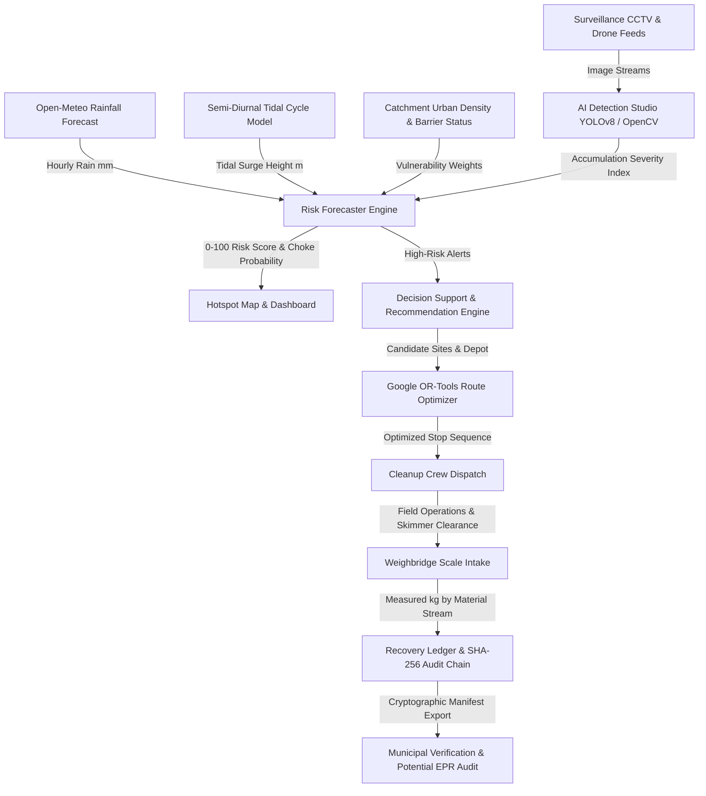

# JalRakshak — Predictive Plastic Leakage Monitoring & Smart Cleanup System

[](https://fastapi.tiangolo.com)
[](https://vitejs.dev)
[](https://github.com/ultralytics/ultralytics)
[](https://xgboost.readthedocs.io)
[](https://developers.google.com/optimization)

> **One-Line Pitch**: JalRakshak forecasts which Mumbai drain outlets are most likely to leak plastic after rainfall, dispatches cleanup crews in an optimized order, and keeps an evidence-backed recovery ledger for potential EPR credit generation.

---

## 1. System Architecture



---

## 2. Real vs. Simulated Provenance Matrix

In accordance with our **Non-Negotiable Honesty Rules**, all data provenance is strictly tracked across the platform:

| Component | Status | Description & Caveats |
|---|---|---|
| **Monitoring Sites (10 Outlets)** | **Real / Approximate** | Real Mumbai outfall coordinates across Mithi River (4), Malad Creek (3), and Trombay / Thane Creek (3) marked as approximate illustration. |
| **Rainfall Weather Data** | **Real / Cached** | Open-Meteo API integration with cached offline fallback for network-resilient demo execution. |
| **Tidal Dynamics** | **Simulated Proxy** | Semi-diurnal sinusoidal tide curve calibrated to Mumbai Gateway of India tide table range (0.8m to 4.8m). |
| **YOLOv8 Detection Model** | **Demo / Synthetic** | Ground model pipeline based on AniLeo-01 (Kili dataset) & ReWater aerial weights. Not fine-tuned on Mumbai monsoon nullahs. |
| **Risk Forecast Model B (XGBoost)** | **Trained on Synthetic** | 1,400 synthetic observations based on physical monsoon assumptions. Evaluated on a strict chronological 70/30 split. |
| **VRP Route Optimizer** | **Simulated Haversine** | Google OR-Tools TSP solver using straight-line haversine distance matrix with simulated Mumbai road transit speeds. |
| **Recovery Weight (kg)** | **Measured Ledger** | Only physical measured weights entered into the ledger count as recovery. Visual severity is never treated as mass. |
| **EPR Credit Eligibility** | **Potential / Conditional** | Assessed for decision support only. Never claimed as guaranteed revenue; requires accredited CPCB/MPCB audit. |
| **5,000 Tonnes/Year Leakage** | **Illustrative Scenario** | Sourced from the InnovateX challenge brief for scenario sensitivity calculations, not a measured project outcome. |

---

## 3. Quick Start (One-Command Setup)

### Prerequisites
- Python 3.10+ (tested on Python 3.11 / 3.14)
- Node.js 18+ and npm

### 1. Backend Setup
```bash
cd backend
python -m venv .venv
# On Windows:
.venv\Scripts\activate
# On Linux/macOS:
source .venv/bin/activate

pip install -r requirements.txt
pip install ortools xgboost

# Start FastAPI backend (port 8000)
python -m uvicorn app.main:app --host 0.0.0.0 --port 8000 --reload
```

### 2. Frontend Setup
```bash
cd frontend
npm install
npm run dev
# App will open at http://localhost:5173
```

### 3. Run Automated Test Suite
```bash
cd backend
python -m pytest tests/ -v
# Output: 11 passed (100% test pass rate)
```

---

## 4. Retraining & Evaluation Guide

### Ground CCTV YOLOv8 Model (Kili Dataset)
```bash
cd ml
python train_ground_yolo.py --data data/plastic.yaml --weights yolov8m.pt --epochs 50 --imgsz 640
```

### Fine-Tuning on Localized Mumbai Nullah Images
Place annotated YOLO-format images into `data/mumbai/images/` and run:
```bash
python ml/finetune_mumbai.py --base-weights yolov8m.pt --data data/mumbai/dataset.yaml --epochs 30
```

### XGBoost Predictive Risk Forecaster
Retrain the gradient boosted decision tree classifier on chronological observation records:
```bash
python ml/train_xgboost_forecast.py
# Generates data/observations.csv and writes evaluated metrics to ml/model_card_metrics.json
```

---

## 5. Model Evaluation Benchmarks

Evaluated on held-out chronological test split (N = 421 unseen future records):

| Pipeline | Model Type | Precision | Recall | F1 Score | ROC-AUC |
|---|---|---|---|---|---|
| **Baseline 1** | Rainfall Only Threshold (≥55mm) | 0.927 | 0.458 | 0.613 | — |
| **Model A** | JalRakshak Physical Heuristic | **0.949** | 0.669 | 0.784 | — |
| **Model B** | **XGBoost Classifier** | 0.821 | **0.855** | **0.838** | **0.956** |

*Note: High precision in Model A minimizes false alarm dispatches; high recall in Model B catches complex tidal-monsoon interactions.*

---

## 6. Open-Source Licenses & Attribution

JalRakshak acknowledges and credits the following open-source projects:

1. **AniLeo-01/Plastic-In-River-Detection**:
   - Training pipeline for YOLOv8m on Kili `plastic_in_river` dataset (classes: `PLASTIC_BAG`, `PLASTIC_BOTTLE`, `OTHER_PLASTIC_WASTE`, `NOT_PLASTIC_WASTE`).
   - Repository: [github.com/AniLeo-01/Plastic-In-River-Detection](https://github.com/AniLeo-01/Plastic-In-River-Detection)
   - Dataset: [huggingface.co/datasets/Kili/plastic_in_river](https://huggingface.co/datasets/Kili/plastic_in_river)

2. **SwastikGorai/ReWater**:
   - Single-class YOLOv8m drone imagery reference for aerial floating plastic mats.
   - License: **MIT License**.
   - Repository: [github.com/SwastikGorai/ReWater](https://github.com/SwastikGorai/ReWater)

3. **Third-Party Frameworks**:
   - **Ultralytics YOLOv8**: Distributed under **AGPL-3.0**. Commercial usage requires Ultralytics commercial licensing.
   - **Google OR-Tools**: Vehicle Routing Problem solver, licensed under **Apache 2.0**.
   - **OpenStreetMap**: Map tiles & data © OpenStreetMap contributors, licensed under **ODbL**.
   - **Open-Meteo**: Weather forecast and historical rainfall API under **CC BY 4.0**.
